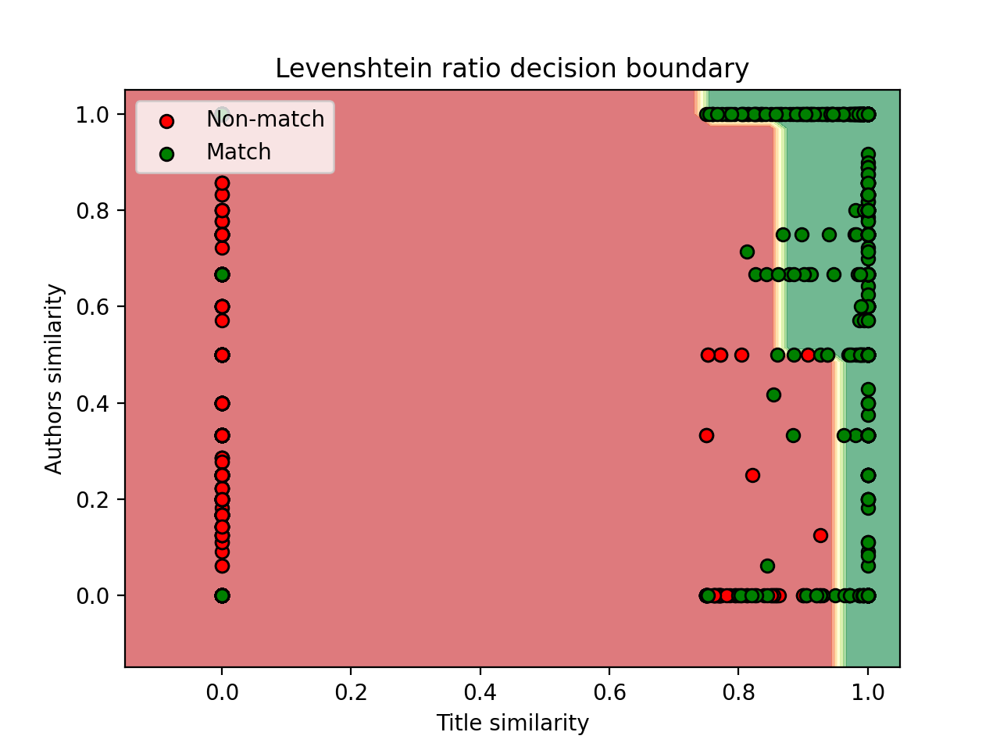
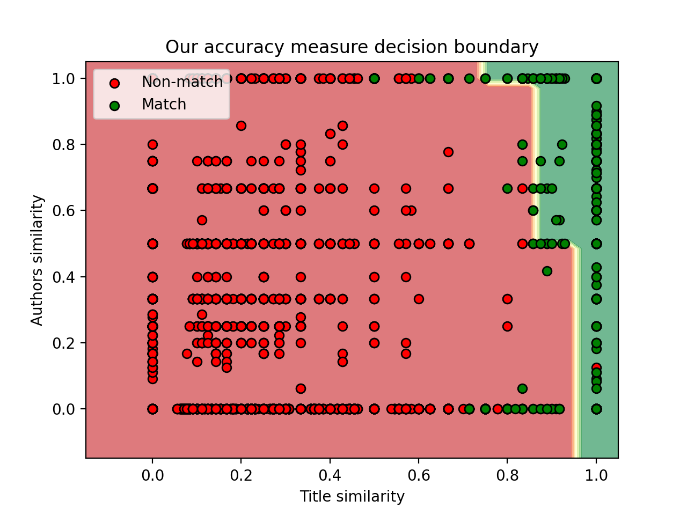
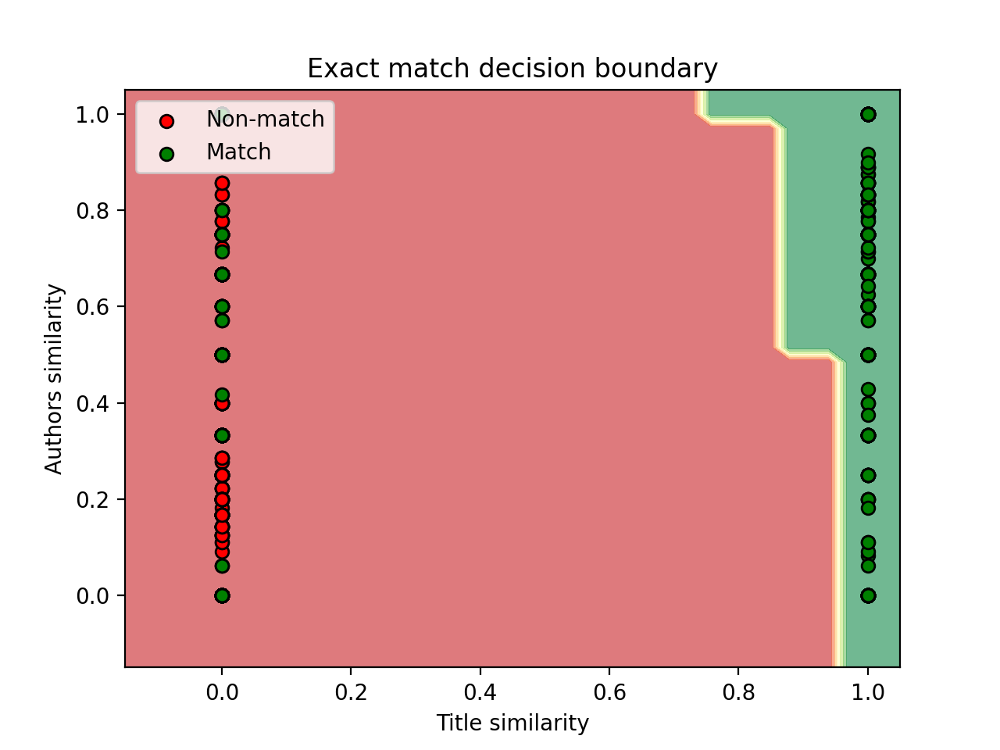

# Task 01: Entity Matching Pipeline
This file is a README for the python script `entity-matching.py`, where we implement a non-machine learning approach to the entity matching of records from two databases.

## Implementation details
In this section, we describe how we match the records and explain our decision rules.

### Records matching
To assess whether two records are the same, we use only the `title` and `authors` columns, as adding the `venue` column to our matching pipeline decreased its accuracy. Our approach to the matching of records is the following:
1. First, we calculate how well the titles of two records match, using one of the three different techniques described below.
2. Then, based on the title match measure, we either declare these records as matching if the similarity is greater or equal to 95 %, or as not matching if the accuracy is lower than 75 %.
3. When the title match measure is between 75 and 95 %, we additionally use the authors match accuracy (see *Our accuracy* in section *Title matching techniques*) to help make an uncertain decision. When the title match accuracy is between 85 and 95 %, we require at least a 50% match of the authors to declare the match of two records and if the title match accuracy is between 75 and 85 %, we require a stronger, perfect match of the authors. If these author requirements are not met, the prediction for the pair will be negative.

### Title matching techniques
We designed three different similarity measures for strings, especially used for the `title` column.
* **Exact match**: this technique is an equal operator and it gives 100% accuracy if the two input strings are equal, otherwise it gives 0% accuracy.
* **Our accuracy measure**: our technique is inspired by intersection over union. We split the two input strings into words and make sets out of them. The accuracy is then calculated as the cardinality of the intersection of the two sets divided by the cardinality of the smaller set, or $\dfrac{|A \cap B|}{\min(|A|, |B|)}$.
* **Levenshtein ratio**: this technique is based on the (normalized) Levenshtein distance. It is calculated as a fraction of the difference between the length of the longer string and the Levenshtein distance between the two input strings and the length of the longer string, or $1 - \dfrac{\text{levenshtein distance}}{\text{longer string length}}$.

## Results
We evaluate the results of our pipeline with three common accuracy metrics in information retrieval, i.e. **precision**, **recall** and **f1 score**.

### Title matching using Levenshtein ratio
The Levenshtein ratio as the title matching measure has the overall best accuracy. It yields the best compromise between precision and recall. The results are:
* precision: **97.23 %**
* recall:    **97.71 %**
* f1 score:  **97.47 %**

In the following plot, points marked as true matches and non-matches are scattered on top of the decision boundary.

### Title matching using our title match accuracy
Our title match accuracy measure has still a very good overall accuracy. It slightly favours recall over precision. The results are:
* precision: **94.21 %**
* recall:    **98.79 %**
* f1 score:  **96.44 %**

Ground truth matches and non-matches can again be seen on the plot of the decision boundary.

### Title matching using exact title match
The exact title match is still a valid option but shows its limitations on the recall side. Precision is very high as expected since predicted matches are always very strong candidates.

The results are:
* precision: **97.97 %**
* recall:    **91.05 %**
* f1 score:  **94.38 %**

Using exact matching is implicitly taking the decision based on one feature only, the title.

## Result reproduction
After installing the requirements for the project, download and extract the data as described in the main README file. Then run the `entity-matching.py` script from the root directory using the commands listed below to reproduce the results:
* `python ./task_01/entity-matching.py -t levenshtein` - for the title matching using the Levenshtein ratio.
* `python ./task_01/entity-matching.py -t accuracy   ` - for the title matching using our title match accuracy.
* `python ./task_01/entity-matching.py -t exact      ` - for the title matching using exact title match.
