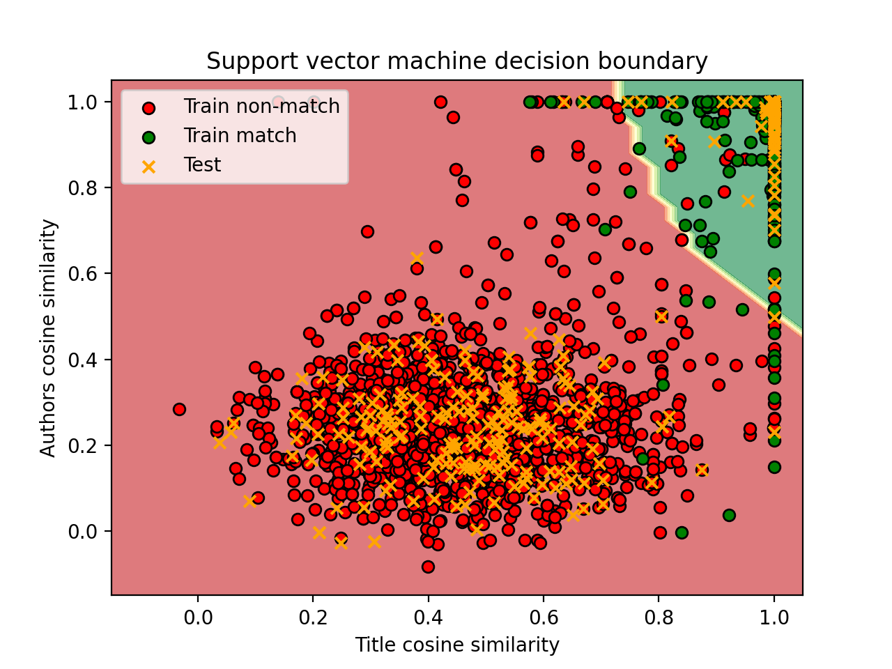

# Task 02: ML Entity Matching Pipeline
This file is a README for the python script `ml-entity-matching.py`, where we implement a machine learning approach to the entity matching of records from two databases.

## Implementation details
In this section, we describe how we match the records and explain the models we used.

### Models and hyper-parameters
We chose three different ML models, which are a neural network, a random forest and a support vector machine. For each one, 3 different sets of hyper-parameters were tested using cross-validation as part of our ML pipeline.

### Records matching
To assess whether two records are the same, we use only the `title` and `authors` columns, as adding the `venue` column to our matching pipeline decreased its accuracy. Our approach to the matching of records consists of a multi-stage pipeline described in the following:
1. First, we use a cheap and fast title similarity measure to further reduce, even after the blocking scheme, the number of candidates to be matches. This is the first-stage decision.
2. Then, with a lower number of pairs to compare, we use a slower but more precise language model as a feature extractor. Given two candidate records, title and authors embeddings are extracted using a language model and cosine similarity is computed between the two title embedding vectors and the two authors embedding vectors.
3. Based on the two features computed for each potential match, a ML model is trained to construct the decision boundary and predict the matches. This is the second-stage decision.

## Results
We evaluate the results of our pipeline with three common accuracy metrics in information retrieval, i.e. **precision**, **recall** and **f1 score**.

### Best performing model based on the cross-validation results
We assess the model performance as an average f1 score over the validation folds. The model with the best cross-validation performance (average of 96.91 % f1 score) is the support vector machine with radial basis function kernel initialization. The results of this model on the test data set, once retrained with all the training samples, are extremely good:
* precision: **98.66 %**
* recall:    **98.66 %**
* f1 score:  **98.66 %**

Furthermore, the results of all the models on both the validation folds and the test data set can be seen in the file `task_02/results_cv.txt`.

Here we can have a look at the training matches, non-matches and test samples scattered on the plot of the decision boundary learned by the model.

## Result reproduction
After installing the requirements for the project, download and extract the data as described in the main README file. Then run the `ml-entity-matching.py` script from the root directory using the commands listed below to reproduce the results:
* `python ./task_02/ml-entity-matching.py` - to obtain the results on the test set of the best performing model on cross-validation.
